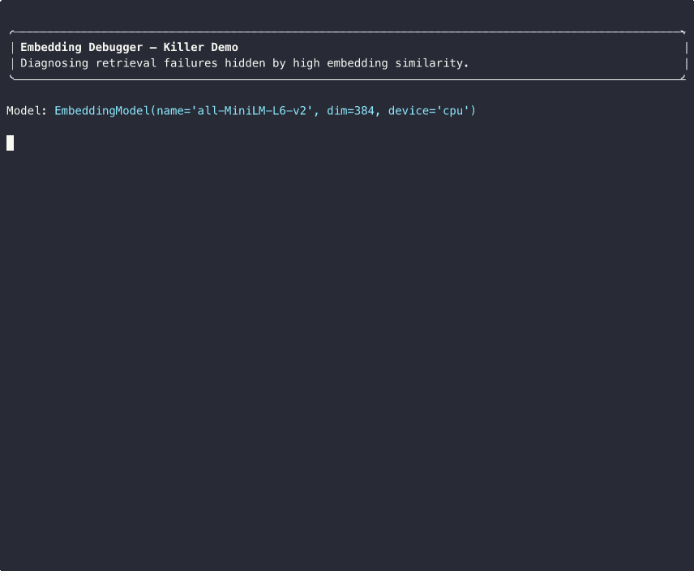

# 🧠 Embedding Debugger

**The microscope for your embedding-based retrieval.**

Embedding Debugger is a **local-first toolkit for debugging retrieval
failures, perturbation sensitivity, neighborhood instability, clustering,
drift, and outliers in text embedding systems.**

If you ship search or RAG on top of embeddings, this gives you the
instrument you've been missing: queries that retrieve the wrong result
at high similarity, perturbations that change meaning but not the
vector, and neighborhoods that quietly shift between models.

[](https://www.python.org/)
[](#testing)
[](LICENSE)
[](RELEASE_NOTES_v0.1.0.md)

---



> *Killer demo flow: a query retrieves the wrong document at 0.97
> cosine similarity, perturbations shift ranks, and the tool exports a
> Markdown debug report — all in one command.*

---

## 🚨 Why this matters

Embeddings power modern search, semantic retrieval, and RAG. But the
same systems routinely fail in ways that aren't obvious from a single
similarity score:

- ❌ **High-similarity wrong retrieval** — top-1 looks confident (0.95+
  cosine), but it's the wrong document.
- ❌ **Order- and structure-blind matches** — reordered steps, reversed
  causality, or swapped subject/object look identical to the original.
- ❌ **Hidden semantic flips** — negation, number changes, and antonym
  swaps move similarity by less than typo noise.
- ❌ **Unstable neighborhoods** — a chunk's top-10 neighbors change when
  you swap models, even within the same family.

Embedding Debugger lets you **see**, **measure**, and **export** these
failures instead of guessing at them.

---

## 🎯 Killer demo (one command)

```bash
python -m demo.killer_demo
```

The killer demo walks through one end-to-end failure flow:

1. **Query** — a forward, order-sensitive prompt.
2. **Retrieved wrong result** — the reversed/scrambled variant comes
   back as top-1.
3. **High similarity score** — cosine ≈ 0.95–0.99.
4. **Perturbation + rank drift** — sweeps 22 perturbations, shows which
   ones the embedding ignores and which actually move the ranking.
5. **Exportable debug report** — writes `killer_demo_report.md` (and
   JSON/CSV companions on request) with queries, retrieved items,
   similarity scores, perturbation outcomes, and failure tags.

> 💡 Run it before you shrug off a retrieval bug as "the index needs
> tuning." Most of the time, the embedding itself is the issue.

### Demo screenshots

> Placeholders — replace with real assets in the v0.1.0 release. Suggested:
>
> - `assets/screens/01_killer_demo_query.png` — query + wrong top-1
> - `assets/screens/02_similarity_score.png` — high similarity score
>   with the wrong retrieval highlighted
> - `assets/screens/03_perturbation_sweep.png` — 22-perturbation grid
>   with rank drift
> - `assets/screens/04_debug_report.png` — exported Markdown report
> - `assets/demo.gif` — full 20–30 s screen recording

```
[ assets/screens/01_killer_demo_query.png ]
[ assets/screens/02_similarity_score.png ]
[ assets/screens/03_perturbation_sweep.png ]
[ assets/screens/04_debug_report.png ]
```

---

## 🔍 Features

### a) Retrieval Debugging
- FAISS-backed top-k retrieval inspector
- Per-query failure analysis (wrong top-1, near-miss, low-margin cases)
- Recall@k and MRR@k metrics
- Rank-drift tracking under perturbations

### b) Perturbation & Robustness
- **22 built-in perturbations across 4 categories.** Coverage explicitly
  includes:
  - Ranking swaps
  - Step reordering
  - Causal reversal
  - Negation injection / antonym swap
  - Number changes
  - Subject–object swap
  - List-item reversal

| Category | Examples | High sim = ? |
|----------|----------|--------------|
| **lexical**             | casing, punctuation, typos | ✅ expected |
| **structural**          | word/sentence shuffle & reversal, truncation | reveals order-insensitive behavior |
| **semantic**            | negation injection, antonym swap, contradiction prefix | 🚨 failure |
| **retrieval-critical**  | step reorder, causal reversal, subject–object swap, list inversion, number swap | 🚨 failure |

### c) Geometry, Drift & Outliers
- KMeans clustering with elbow selection
- 2D projection via PCA and UMAP
- Outlier detection: LOF, Isolation Forest, centroid distance
- Cross-model neighborhood stability via RBO-ext (fixed: identical
  lists score 1.0)
- Procrustes-aligned centroid drift across models or time

### d) Exportable Reports
- `DebugReport` writer → Markdown, JSON, and CSV
- One-shot `retrieval_report(...)` helper
- Reports include queries, retrieved items, similarity scores,
  perturbation outcomes, and failure tags — copy-paste-ready for PRs,
  notebooks, or trackers

---

## ⚡ Quickstart

### 1. Install

```bash
git clone https://github.com/kelu-look/embedding-debugger.git
cd embedding-debugger
pip install -r requirements.txt
```

Python 3.10+. CPU-only works; GPU optional for the embedding backbone.

### 2. Launch the UI

```bash
streamlit run app/streamlit_app.py
```

Open the local URL. Start with **🎯 Killer Demo** for the full failure
pipeline; the Retrieval, Perturbation, Clustering, Comparison, Drift,
and Outliers pages let you drill in.

### 3. Run the killer demo from the CLI

```bash
python -m demo.killer_demo
# Try a different model:
python -m demo.killer_demo --model gte-small
```

Output: a console report and `killer_demo_report.md` in the working
directory.

### 4. Use the library

```python
from embedding_debugger.export import retrieval_report

report = retrieval_report(
    model="all-MiniLM-L6-v2",
    dataset="faq",
    failures_df=df,
    metrics={"recall_at_1": 0.85, "mrr": 0.91},
)
report.to_markdown("report.md")
report.to_json("report.json")
report.to_csv("failures.csv")
```

---

## 🧪 Example: high-similarity wrong retrieval

**Query:** `"Step 1: boil water → Step 2: add pasta"`

**Retrieved top-1:** `"Step 1: add pasta → Step 2: boil water"`

Despite the reversed meaning:
- cosine similarity ≈ 0.99
- ranked as top result

> The embedding treats this meaning-changing permutation as nearly
> identical. Embedding Debugger surfaces this in one report.

More examples from the curated test set:

```
subject_object_swap:  "The company acquired the startup."
                    → "The startup acquired the company."   cosine ~0.93

causal_reversal:    "The power outage caused the server crash."
                  → "The server crash caused the power outage."  cosine ~0.95

step_reorder:       (5-step backup procedure, steps scrambled)  cosine ~0.97

list_item_reversal: "priorities: safety, reliability, performance, cost"
                  → "priorities: cost, performance, reliability, safety"  cosine ~0.96
```

---

## 🏗️ Project layout

```
embedding_debugger/
  models.py        # EmbeddingModel: SBERT, E5, GTE, BGE loader
  similarity.py    # Cosine, top-k, RBO-ext neighborhood stability
  perturbation.py  # 22 perturbations across 4 categories
  retrieval.py     # FAISS + failure analysis + rank drift
  clustering.py    # KMeans + PCA/UMAP
  drift.py         # Procrustes + neighborhood stability
  outliers.py      # LOF, Isolation Forest, centroid distance
  export.py        # DebugReport → JSON / CSV / Markdown

app/
  streamlit_app.py
  pages/killer_demo.py
  pages/retrieval.py
  pages/perturbation.py
  pages/clustering.py
  pages/comparison.py
  pages/drift.py
  pages/outliers.py

demo/
  datasets.py        # 5 built-in datasets, no download
  failure_cases.py   # 15 curated adversarial pairs
  killer_demo.py     # One-command demo
  experiments.py     # Batch experiment runner
```

---

## 🧭 Design principles

- **Local-first** — no API dependency, runs fully offline.
- **Modular & extensible** — swap in any HuggingFace model, any dataset.
- **Diagnostics over visualization** — every output answers a specific
  failure question.
- **Reproducible** — deterministic tests, cached embeddings, export at
  every step.
- **Focused on real failure modes** — built around documented,
  reproducible embedding pathologies.

---

## 🛣️ Roadmap

- [ ] **Benchmark-style evaluation mode** — turnkey runs across a fixed
      perturbation suite and dataset for reproducible model comparisons.
- [ ] **Structured perturbation suites** — versioned perturbation packs
      tagged by failure category and difficulty.
- [ ] **Retrieval guardrails** — runtime checks (rank stability,
      similarity-margin floors, perturbation-sanity probes) that can
      block or flag suspect retrievals.
- [ ] **Model comparison reports** — side-by-side reports for two or
      more embedding models on the same data, with neighborhood
      stability and disagreement highlighting.
- [ ] **Exportable debugging reports** — richer HTML / PDF report
      formats in addition to the current Markdown / JSON / CSV.
- [ ] **RAG integration** — hooks for LangChain / LlamaIndex / custom
      pipelines to drop debugging in alongside production retrieval.
- [ ] Failure-case mining across user datasets
- [ ] Token-level attribution / saliency
- [ ] BM25 vs dense retrieval comparison
- [ ] Custom dataset upload in the UI (CSV / JSONL)

---

## 🤝 Use cases

- Debugging embedding-based retrieval systems
- Evaluating robustness of embedding models before deployment
- Comparing SBERT / E5 / GTE / BGE behaviors on your data
- Analyzing dataset structure and representation drift
- Building regression suites for retrieval quality

---

## ✅ Testing

```bash
pytest tests/ -v
# 78 tests, all passing, no model download required
```

Tests use deterministic fake embedders (numpy). Coverage includes all
22 perturbation types, `is_failure` logic, FAISS retrieval, export, and
the curated failure cases dataset.

---

## 📦 Supported models

| Name | HuggingFace ID | Dim |
|------|----------------|-----|
| `all-MiniLM-L6-v2` | sentence-transformers/all-MiniLM-L6-v2 | 384 |
| `all-mpnet-base-v2` | sentence-transformers/all-mpnet-base-v2 | 768 |
| `e5-small-v2` | intfloat/e5-small-v2 | 384 |
| `e5-base-v2` | intfloat/e5-base-v2 | 768 |
| `gte-small` | thenlper/gte-small | 384 |
| `gte-base` | thenlper/gte-base | 768 |
| `bge-small-en-v1.5` | BAAI/bge-small-en-v1.5 | 384 |
| `paraphrase-MiniLM-L6-v2` | sentence-transformers/paraphrase-MiniLM-L6-v2 | 384 |

Models are downloaded from HuggingFace on first use (~80–400 MB) and
cached locally.

---

## 📚 Citing

If Embedding Debugger is useful in your work, please cite the software
artifact. See [`CITATION.cff`](CITATION.cff) for machine-readable
metadata, or use:

```bibtex
@software{lu_embedding_debugger_2026,
  author  = {Lu, Ke},
  title   = {Embedding Debugger: a local-first toolkit for debugging
             retrieval failures and hidden behaviors in text embeddings},
  year    = {2026},
  version = {0.1.0},
  url     = {https://github.com/kelu-look/embedding-debugger},
  license = {MIT}
}
```

For a permanent DOI, the repo can be archived via Zenodo by linking the
GitHub account on [zenodo.org/account/settings/github](https://zenodo.org/account/settings/github),
enabling Embedding Debugger, and publishing the v0.1.0 release on
GitHub. Zenodo will mint a DOI automatically — update this section with
it once issued.

---

## 📝 Changelog

See [`CHANGELOG.md`](CHANGELOG.md). Release notes for v0.1.0 live in
[`RELEASE_NOTES_v0.1.0.md`](RELEASE_NOTES_v0.1.0.md).

---

## License

MIT.

> **GitHub description:** Debug retrieval failures and hidden behaviors in text embeddings.

⭐ If this saves you a debugging session, star the repo and open an
issue with what you found.
